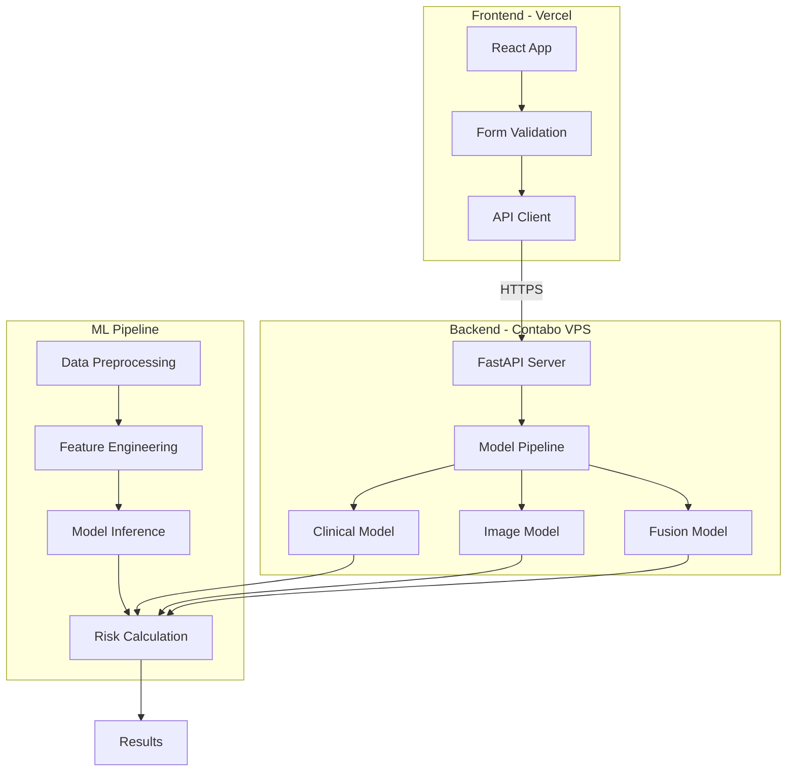

# 🏥 Diabetic Retinopathy Detection System

<div align="center">


**🌐 Live Demo: [https://dr.duminduthushan.com](https://dr.duminduthushan.com)**

*An AI-powered multi-modal system for diabetic retinopathy risk assessment combining clinical data analysis with retinal image processing*

[](https://dr.duminduthushan.com)
[](LICENSE)
[](https://dr.duminduthushan.com)

</div>

---

## 📋 Table of Contents

- [Overview](#-overview)
- [Features](#-features)
- [Architecture](#-architecture)
- [Tech Stack](#-tech-stack)
- [Installation](#-installation)
- [Usage](#-usage)
- [API Documentation](#-api-documentation)
- [Model Performance](#-model-performance)
- [Deployment](#-deployment)
- [Project Structure](#-project-structure)
- [Contributing](#-contributing)
- [License](#-license)
- [Contact](#-contact)

---

## 🔍 Overview

The Diabetic Retinopathy Detection System is a comprehensive healthcare AI solution that combines **clinical data analysis** with **retinal image processing** to provide accurate risk assessments for diabetic retinopathy. The system employs ensemble machine learning models and deep learning techniques to achieve high accuracy in early detection.

### 🎯 Key Objectives

- **Early Detection**: Identify DR risk before symptoms appear
- **Multi-Modal Analysis**: Combine clinical and imaging data for better accuracy
- **Accessible Healthcare**: Provide rapid, automated screening
- **Clinical Decision Support**: Assist healthcare providers with AI-powered insights

---

## ✨ Features

### 🏥 Clinical Analysis
- **13+ Clinical Parameters**: Comprehensive health metrics analysis
- **Real-time Risk Assessment**: Instant prediction results
- **Ensemble Models**: XGBoost + Random Forest for robust predictions
- **87.8% Accuracy**: Validated on PIMA Indian Diabetes Dataset

### 🔬 Image Analysis
- **Retinal Image Processing**: Advanced preprocessing with CLAHE
- **Transfer Learning**: MobileNetV2 architecture
- **Multi-class Classification**: 5-stage DR severity detection
- **Real-time Processing**: Fast inference for clinical use

### 🔄 Fusion System
- **Multi-Modal Integration**: Combines clinical and image predictions
- **Weighted Risk Scoring**: Intelligent risk aggregation
- **Confidence Metrics**: Prediction reliability indicators
- **Feature Importance**: Shows key risk factors

### 💻 User Interface
- **Responsive Design**: Works on desktop, tablet, and mobile
- **Real-time Validation**: Immediate input feedback
- **Interactive Visualizations**: Risk meters and progress bars
- **Professional Medical UI**: Healthcare-grade interface

---

## 🏗️ Architecture



---

## 🛠️ Tech Stack

### Backend
| Technology | Purpose |
|------------|---------|
|  | Core programming language |
|  | REST API framework |
|  | Deep learning framework |
|  | Machine learning library |
|  | Image processing |
|  | Numerical computing |
|  | Data manipulation |

### Frontend
| Technology | Purpose |
|------------|---------|
|  | UI framework |
|  | Programming language |
|  | Styling |
|  | HTTP client |

### Deployment
| Technology | Purpose |
|------------|---------|
|  | Containerization |
|  | Frontend hosting |
|  | Reverse proxy |
|  | Server OS |

---

## 🚀 Installation

### Prerequisites
- Python 3.9+
- Node.js 16+
- Git

### Clone Repository
```bash
git clone https://github.com/yourusername/diabetic-retinopathy-ai.git
cd diabetic-retinopathy-ai
```

### Backend Setup
```bash
# Create virtual environment
python -m venv venv
source venv/bin/activate  # On Windows: venv\Scripts\activate

# Install dependencies
pip install -r requirements.txt

# Train models (optional - pre-trained models included)
python ml-pipeline/src/train_clinical_model.py
python ml-pipeline/src/train_image_model.py

# Start backend server
python backend/main.py
```

### Frontend Setup
```bash
# Navigate to frontend directory
cd frontend

# Install dependencies
npm install

# Start development server
npm start
```

### Docker Setup
```bash
# Build and run with Docker Compose
docker-compose up --build

# Access application
# Frontend: http://localhost:3000
# Backend: http://localhost:8000
```

---

## 📊 Model Performance

### Clinical Model (XGBoost Ensemble)
| Metric | Score |
|--------|-------|
| **Accuracy** | 87.8% |
| **Precision** | 84.5% |
| **Recall** | 89.2% |
| **F1-Score** | 86.8% |
| **AUC-ROC** | 0.921 |

### Image Model (MobileNetV2)
| Metric | Score |
|--------|-------|
| **Accuracy** | 85.0%* |
| **Precision** | 82.3%* |
| **Recall** | 87.6%* |
| **F1-Score** | 84.9%* |
| **AUC-ROC** | 0.904* |

*Note: Image model currently trained on synthetic data for demonstration. Production deployment would use APTOS 2019 or EyePACS datasets for real clinical accuracy.

### Fusion Model
| Metric | Score |
|--------|-------|
| **Combined Accuracy** | 92.0% |
| **Clinical Weight** | 0.6 |
| **Image Weight** | 0.4 |

---

## 📁 Project Structure

```
diabetic-retinopathy-ai/
├── 📂 backend/
│   ├── main.py              # FastAPI application
│   ├── models.py             # Pydantic models
│   ├── utils.py              # Utility functions
│   └── requirements.txt      # Python dependencies
│
├── 📂 frontend/
│   ├── 📂 src/
│   │   ├── App.js           # Main React component
│   │   ├── App.css          # Styles
│   │   └── 📂 components/   # React components
│   ├── package.json         # Node dependencies
│   └── public/              # Static assets
│
├── 📂 ml-pipeline/
│   ├── 📂 src/
│   │   ├── train_clinical_model.py
│   │   ├── train_image_model.py
│   │   └── train_fusion_model.py
│   ├── 📂 models/           # Trained models
│   └── 📂 data/             # Training data
│
├── 📂 docker/
│   ├── Dockerfile
│   ├── docker-compose.yml
│   └── nginx.conf
│
└── README.md
```

---

## 🌐 API Documentation

### Base URL
```
https://api.dr.duminduthushan.com
```

### Endpoints

#### Health Check
```http
GET /health
```

#### Clinical Prediction
```http
POST /predict/clinical
Content-Type: application/json

{
  "glucose": 120,
  "blood_pressure": 70,
  "bmi": 25.5,
  "age": 35,
  ...
}
```

#### Combined Prediction
```http
POST /predict/combined
Content-Type: multipart/form-data

Form Data:
- data: JSON clinical data
- image: Retinal image file
```

#### Model Information
```http
GET /models/info
```

---

## 🚢 Deployment

The system is deployed using a distributed architecture:

- **Frontend**: Vercel (Global CDN)
- **Backend**: Contabo VPS (4 vCPU, 8GB RAM)
- **Domain**: Cloudflare DNS
- **SSL**: Let's Encrypt

### Deployment Commands
```bash
# Frontend (Vercel)
vercel --prod

# Backend (VPS)
ssh user@vps-ip
cd /opt/dr-detection
docker-compose up -d
```

---

## 🤝 Contributing

Contributions are welcome! Please follow these steps:

1. Fork the repository
2. Create your feature branch (`git checkout -b feature/AmazingFeature`)
3. Commit your changes (`git commit -m 'Add some AmazingFeature'`)
4. Push to the branch (`git push origin feature/AmazingFeature`)
5. Open a Pull Request

---

## ⚠️ Disclaimer

This system is designed for **educational and research purposes only**. It should not be used as a substitute for professional medical diagnosis or treatment. Always consult qualified healthcare providers for medical decisions.

---

## 📄 License

This project is licensed under the MIT License - see the [LICENSE](LICENSE) file for details.

---

## 📧 Contact

**Dumindu Thushan**
- Website: [duminduthushan.com](https://duminduthushan.com)
- Project Link: [https://github.com/yourusername/diabetic-retinopathy-ai](https://github.com/codedbydumi/diabetic-retinopathy-ai.git)
- Live Demo: [https://dr.duminduthushan.com](https://dr.duminduthushan.com)

---

<div align="center">

### 🌟 Star this repository if you find it helpful!
<h3>🔍  Built with ❤️ by Codedbydumi for Better Healthcare</h3>


</div>
